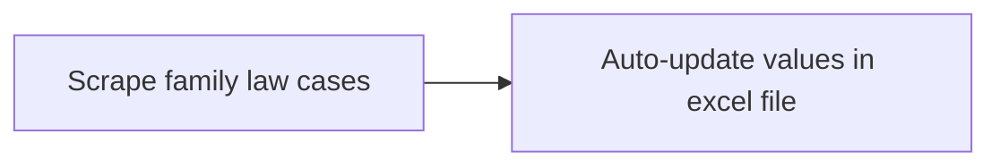

# What does this project aim to do?
The lambda functions found in the lambda_functions folder are used to scrape family law cases relating to the "division of matrimonial assets" (exact search query) from eLit/Lawnet. These are configured to run daily on AWS Lambda, and will store any new judgments found in the respective S3 buckets. Subsequently, GPT-4 will be used to extract certain information from the judgments, and stored in a separate excel file (compilation of all the precedents). A simple illustration can be found below.

# Pipeline

# Helpful commands

## Activate and use venv
python3.9 -m venv my_virtual_env
source ./my_virtual_env/bin/activate

## Install dependencies (other dependencies are already set in aws lambda config layers)
pip install boto3
pip install requests
pip install beautifulsoup4
pip install urljoin

## To derive the zip deployment package - repeat the last command to update the lambda functions
cd my_virtual_env/lib/python3.9/site-packages
zip -r ../../../../my_deployment_package.zip .
cd ../../../../
zip my_deployment_package.zip lambda_function.py