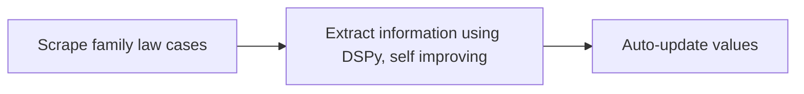

# Pipeline

```mermaid
flowchart LR
  A[Scrape family law cases] --> B[Extract information using DSPy, self improving] --> C[Auto-update values]
```

# Overview of scraper

```mermaid
flowchart LR
  A[Lambda function that operates daily] --> B[Judiciary website] --> C[Filter by family court cases] --> D[Access eLitigation] --> E[Scrape eLitigation using HTML tags] --> F[Save to S3]
```

Directory structure
.env - environment variables
judgments/ - scraped judgments
scraper/judgment_scraper.py - scraper